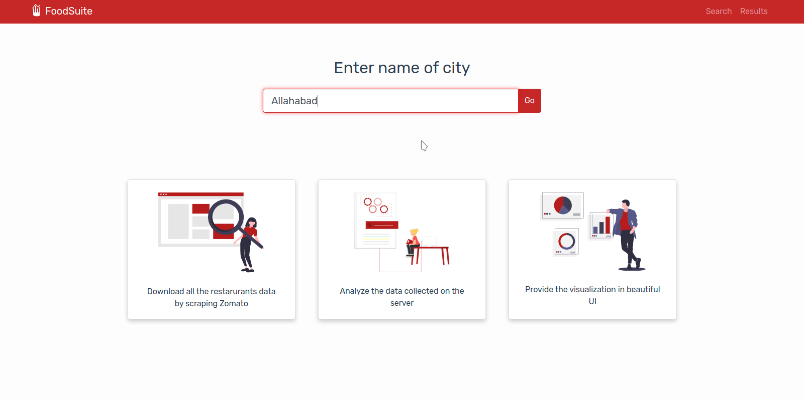
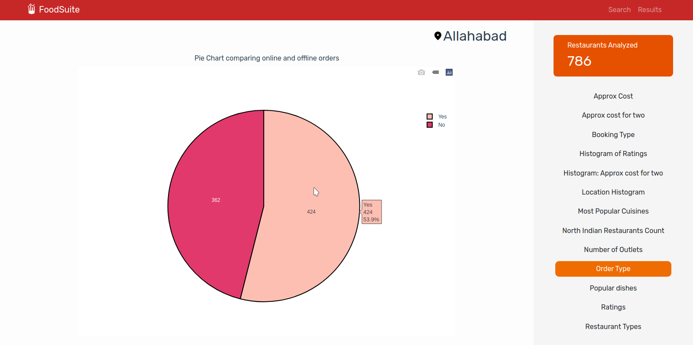
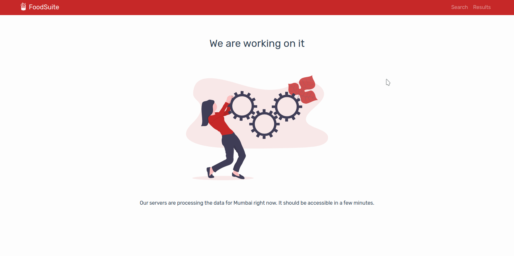

# RestaurantTrends.stats

For restaurant owners or people thinking to open a new restaurant in an area it can beneficial to know the popular food choices of people and restaurant sales trends in the locality. These insights could help you customize your menu to attract more customers or choose the ideal place to open up your new restaurant. With this goal in mind we created a website where you **simply enter the city name and it will give you a easy visualization of some of the knowledge extracted by scraping the data of existing restaurants in the city from the Zomato website and API.** 

The backend repository could be found [here](https://github.com/rahul-jha98/RestaurantTrends.stats-Backend)


> Right now the web app works for only Allahabad, Meerut, Mumbai and Bengaluru. 

## Working of the web app:

- User is first greeted with the home screen where he is prompted to enter the City name.



- When the city name is aleady analyzed and uploaded to Firebase the visualizations are shown.



- If the city name is not found in firebase we will hit our own backend server. The backend will begin processing and we show this screen to the user.



## Project setup
```
npm install
```
*Compiles and hot-reloads for development*

```
npm run serve
```
